# 프로젝트 설명
**프로젝트: 논문 코드 구현**

## [논문 클릭](https://s3-us-west-2.amazonaws.com/openai-assets/research-covers/language-unsupervised/language_understanding_paper.pdf)

## 데이터
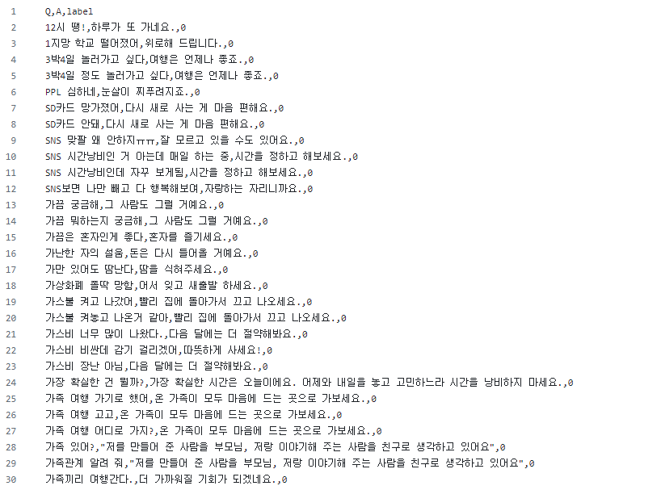

기존 Quest에서 구현하였던 Transformer 코드를 활용하여 위 논문을 참고해 모듈 구조를 변경한 후 돌아가게 만드는 메인 퀘스트입니다.

# 프로젝트 진행 과정
1. 인코더 제거 및 부분부분 모델 구조 변경
2. 모델 입력 형태 전처리
3. 정상적으로 돌아가는지 확인
4. 입력에 따른 출력 생성 확인

# 목표
1. Transformer와 비교해 변경이 필요한 부분을 서술하였다. 
[변경이 필요한 부분](##-새로운-모델-구조)
2. 모델의 입력 형태에 맞게 전처리를 수행하였다.
3. 모델의 입력 블럭을 GPT 논문에 기반하여 수정하였다.
4. GPT 모델을 정상적으로 구성하였다. (Model.summary, model.fit 결과 캡쳐 첨부)
5. 입력에 따른 출력이 생성되었다.

## 기존 트랜스포머 모델 구조
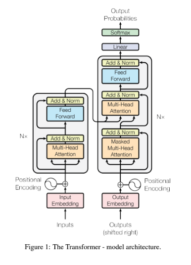
## 새로운 모델 구조
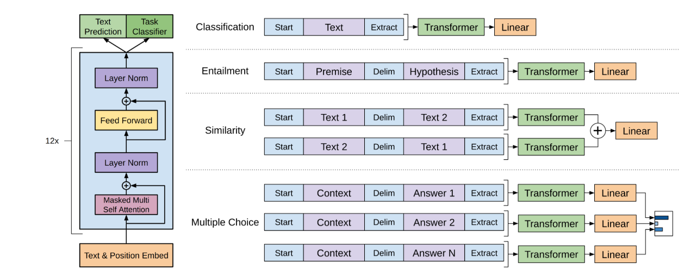

기존 트랜스포머 모델과 다른점은 대량의 라벨링이 되지 않은 데이터셋에서 학습을 진행한다는 점입니다. 그렇기에 인코더를 제거하고 인코더에서 변수를 받아오는 디코더의 Masked Multi Head Layer를 제거하는 식으로 모델을 새로 구성하였습니다.

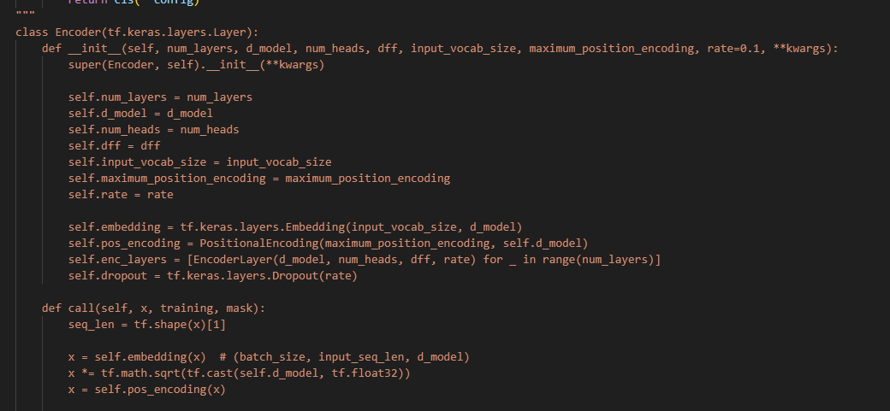

기존 인코더 레이어는 주석처리를 하여 트랜스포머 모델이 인코더를 불러오지 않게 수정하였습니다.

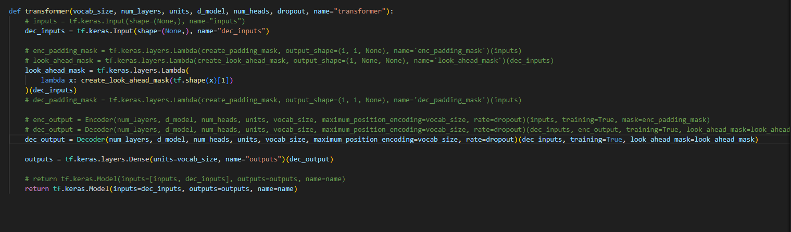

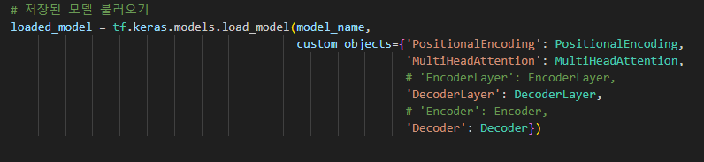

트랜스포머 모델의 입력값 1개만 불러오게 처리, 인코딩 레이어 불러오는 부분 주석처리 등 새로운 모델 구조에 맞게 수정하였습니다.

디코더 레이어 내부에서도 제거된 Multi Head Layer 부분도 주석처리를 하였습니다.

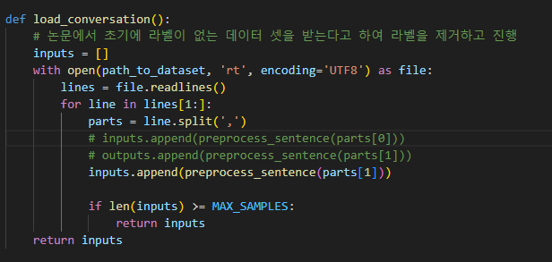

처음에는 질문 부분만 학습에 넣었는데, 학습을 원하는 부분이 뒷부분의 답변이기에 parts[1]부분을 학습 데이터셋으로 활용

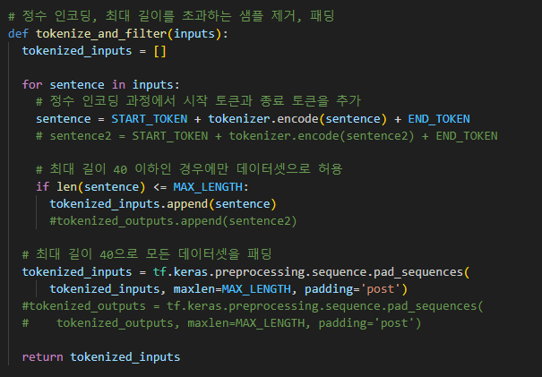

질문과 대답 두개의 문장에 인코딩 작업을 하던 코드도 그에 따라 1개의 인풋을 받고 토크나이징 할 수 있게 변환

# 파일 설명

# Requirements

1. Python 3.9
2. Tensorflow 4.9.3
3. numpy 1.23.0
4. tensorflow_datasets 4.9.2

# 모델 설명

베이스로 이용했던 코드들에 대한 설명은 [링크](../../Quests/Quest8_20240619/README.md)에서 확인할 수 있습니다.

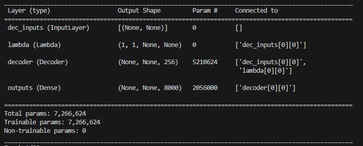

기존 모델이 인코더 & 디코더의 구조였다면 지금은 디코더만 존재하는 구조입니다.
디코더 속 세부 층들은 [디코더 레이어](transformer/Layers.py)에서 확인할 수 있습니다.

# 결과 화면

### 모델 훈련

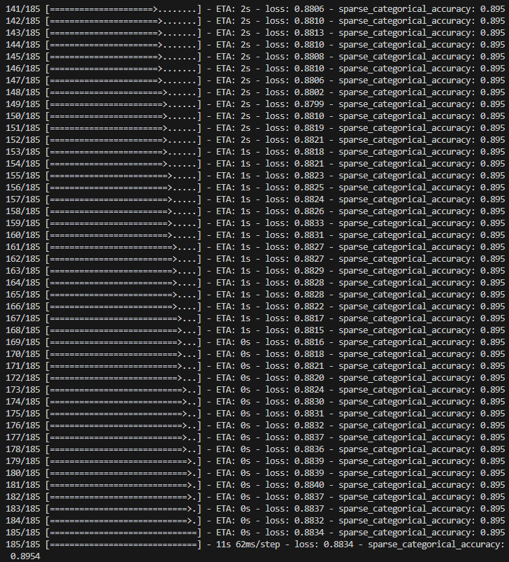

처음에는 인풋값이 다르고 각 레이어 별로 2개의 인풋을 기대하게 구성되어 있는 초기 설정들 때문에 학습이 진행되지 않았지만 각 구성요소 수정 후 정상적으로 훈련 진행 성공

### 각 에폭별 모델 저장

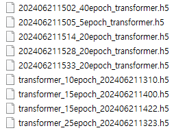

h5 모델은 사이즈 문제로 깃에 올리지 않았지만 에폭별, 드롭아웃 비율, 학습률에 따라 다르게 저장해 테스트를 진행해보았습니다.

### 실패 결과

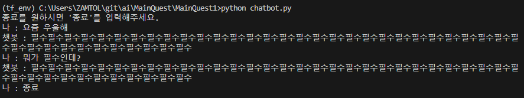

위 사진처럼 60에폭에 학습을 진행하니 데이터 셋 양이 작은 문제도 있어서 그런지 과대적합이 심하게 된 모습을 보인다.

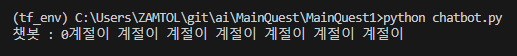

# 참고자료

* [Transformers, explained: Understand the model behind GPT, BERT, and T5](https://www.youtube.com/watch?v=SZorAJ4I-sA)
* [트랜스포머 파헤치기](https://www.blossominkyung.com/deeplearning/transformer-mha)
* [attention-is-all-you-need-pytorch](https://github.com/jadore801120/attention-is-all-you-need-pytorch/tree/master?tab=readme-ov-file)
* [Chatbot_data](https://github.com/songys/Chatbot_data/tree/master)