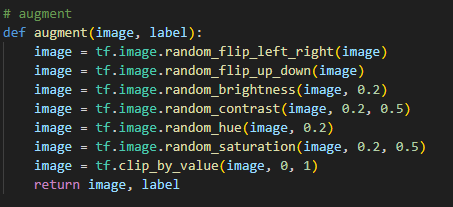
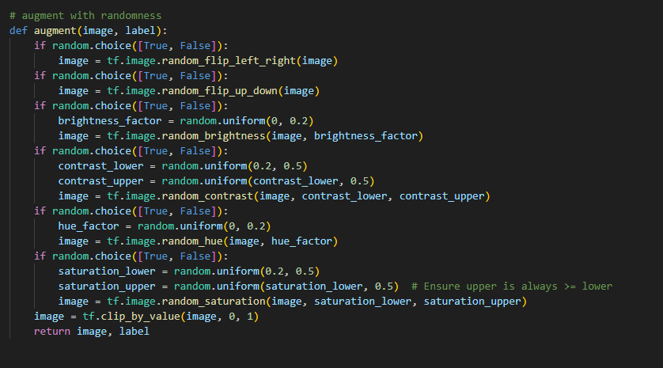

### [피어리뷰 보러가기(클릭)](PRT.md)

# 프로젝트 설명
**프로젝트: 프로젝트: CutMix 또는 Mixup 비교실험 하기**

## 데이터

# 프로젝트 진행 과정
1. 

# 목표
1.  CutMix와 MixUp 기법을 ResNet50 분류기에 성공적으로 적용하였는가? [모델 설명](#모델-설명)
- CutMix와 MixUp을 적용한 데이터셋으로 훈련한 각각의 ResNet 모델이 수렴하였다.

2. 다양한 실험을 통해 태스크에 최적인 Augmentation 기법을 찾아내었는가?[실행 결과](#실행 결과)
- 각 Augmentation 기법을 적용하고, 그에 따른 성능 비교 분석 및 문제점을 서술하였음

3. 여러가지 Augmentation 기법을 적용한 결과를 체계적으로 비교분석하였는가? [실행 결과]()

- 기본 Augmentation, CutMix, MixUp이 적용된 결과를 시각화와 함께 체계적으로 분석하였다.

# 파일 설명

# 모델 설명
## CutMix

## MixUp

# 실행 결과

## resnet50 vs aug_resnet50

20에폭으로 테스트를 진행해봤는데 단순 CutMix Augmentation을 취한 모델이 전체적으로 취하지 않은 모델보다 성능 면에서 좋지 못한 결과물을 보이고 있다
-> 다음실험: 여러 Augmentation 기법들을 수행해보고 성능면에서 진척도를 보이는 기법 찾기

## Random Augmentation

이미지 Augmentation 기법은 위 코드처럼 다양하게 있는데, 이를 모든 이미지에서 처리보다는 모든 부분에 랜덤성을 부여하면 좋지 않을까 라는 새로운 가설

이처럼 각 코드의 줄의 실행여부, 수치정도 모두 랜덤성 부여해서 augmentation을 진행하게 수정

# 회고

## 배운점

## 아쉬운점

## 느낀점

## 궁금한 내용

# 참고자료

* 