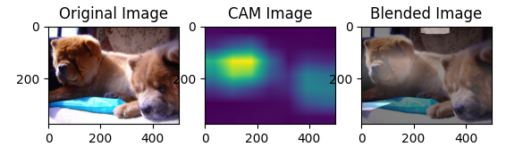
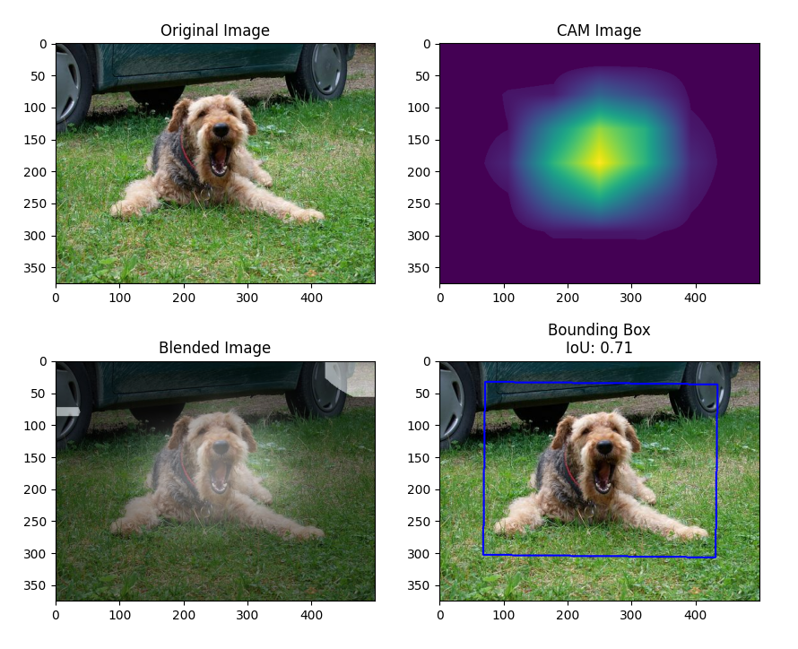
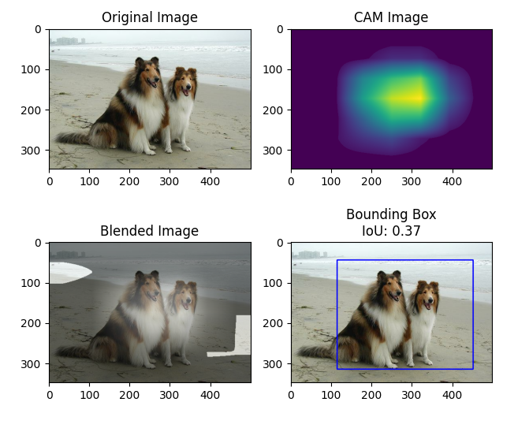
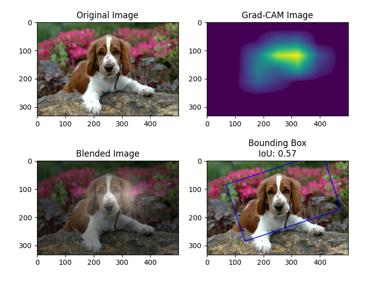
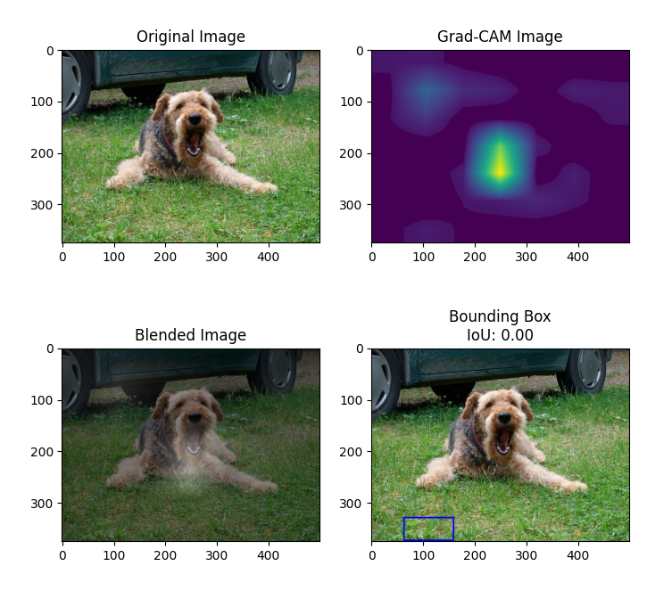
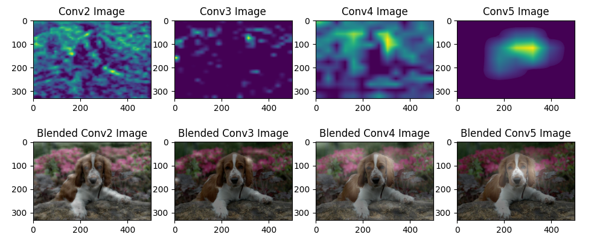
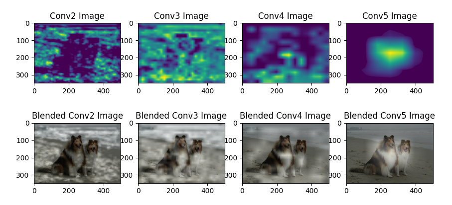

### [피어리뷰 보러가기(클릭)](PRT.md)

# 프로젝트 설명
**프로젝트: 나를 찾아줘 - Class Activation Map 만들기**

## 데이터

# 프로젝트 진행 과정
1. 

# 목표
1. CAM을 얻기 위한 기본모델의 구성과 학습이 정상 진행되었는가? [클릭](#모델-설명)

- ResNet50 + GAP + DenseLayer 결합된 CAM 모델의 학습과정이 안정적으로 수렴하였다.

2. 분류근거를 설명 가능한 Class activation map을 얻을 수 있는가? [클릭](#실행-결과)

- CAM 방식과 Grad-CAM 방식의 class activation map이 정상적으로 얻어지며, 시각화하였을 때 해당 object의 주요 특징 위치를 잘 반영한다.

3. 인식결과의 시각화 및 성능 분석을 적절히 수행하였는가? [클릭](#결과-분석)

- CAM과 Grad-CAM 각각에 대해 원본이미지합성, 바운딩박스, IoU 계산 과정을 통해 CAM과 Grad-CAM의 object localization 성능이 비교분석되었다.

# 파일 설명

# 모델 설명

# 실행 결과

## CAM 방식의 시각화

## Grad-CAM 방식의 시각화

# 결과 분석

## CAM

## Grad-CAM

## Grad-CAM by filters

# 회고

## 배운점
각 채널별로 어떻게 활성화되는 정도를 시각화하고 보여줄 수 있는지 그 방법들을 알 수 있는 시간이었습니다.

## 아쉬운점
실시간으로 웹캠을 사용해서 시각화하는 방법을 시도해보고 싶었는데 하지 못해 아쉬웠습니다.

## 느낀점
AI를 바라보는 또다른 시각인 XAI에 대해 다뤄보는 시간이라 재밌었습니다.

## 궁금한 내용
어떻게 이 과정들을 실시간으로 돌아갈 수 있게 코드를 수정 할 수 있을지 궁금합니다.

# 참고자료

* 