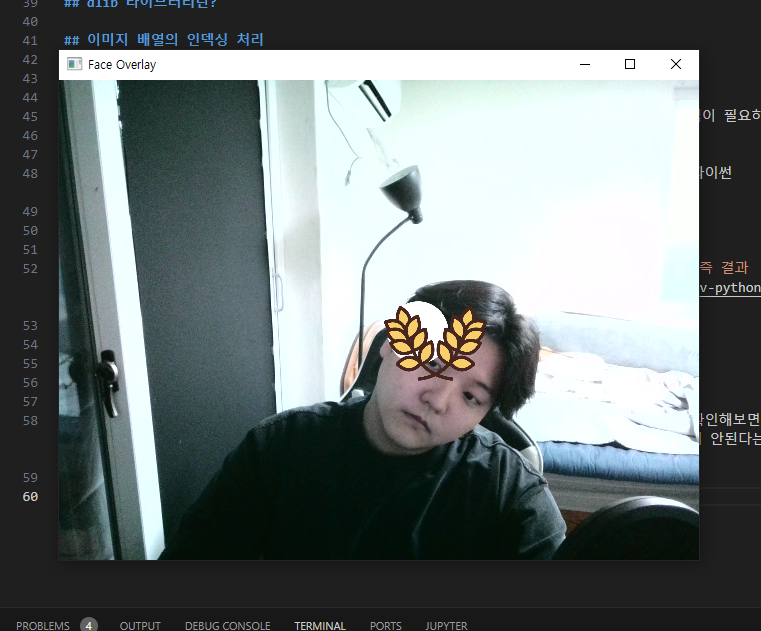
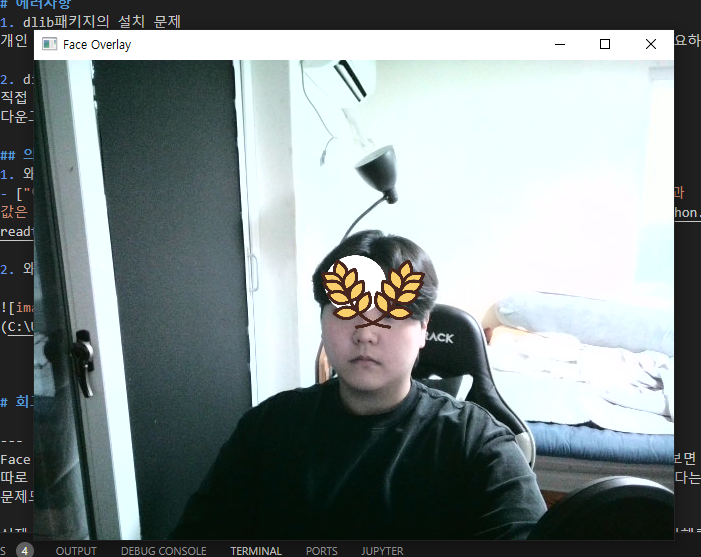
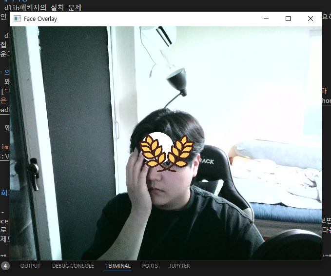
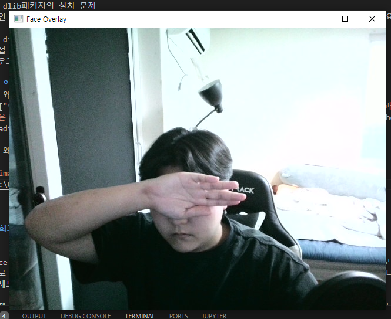

# 카메라 스티커앱 만들기 프로젝트

## 기술
---
* 동영상 처리
* 검출
* 키포인트 추정
* 추적
* 카메라 원근의 기술

## 목표
---
* 얼굴인식 카메라의 흐름을 이해
* dlib 라이브러리 사용하여 실습
* 이미지 배열의 인덱싱 예외 처리

## 얼굴인식 카메라의 흐름

1. 사진 준비
자연스로운 스티커 적용을 위해 눈, 코, 입, 귀와 같이 얼굴의 각부분들의 위치 파악이 중요. 이 위치 파악에 유용한 기술이 landmark(조정 alingment). 지금 같은 경우 Face Landmark라고 부를 수 있는데 랜드마크별 거리등을 계산하여 유추 가능

2. Face Detection [얼굴 검출]
빠른 개발을 위해 만들어져 있는 패키지를 활용하여 디텍션 진행
dlib패키지 사용 (HOG와 SVM을 합쳐 얼굴 검출을 진행하는 모델)

3. Face Landmark [얼굴 랜드마크]
이목구비의 위치를 아는 기술 ->  face landmark localization 기술
이전 단계에서 검출한 (crop한) 얼굴에 해당 기술 이용

이런식으로 얼굴의 각 주요 키포인트의 위치를 검출하는 기술이 object keypoint estimation이라고도 부름
이 기술도 이전 단계에서 시행한 boundingbox의 여부에 따라 접근하는 법이 다름
있는 경우 그 bounding box안에서만 key point들을 검출하고 없는 경우 먼저 key point들을 찾은 후 포인트들이 모이는 군집들을 보고 후에 box를 생성

4. Sticker Apply

이전 랜드마크의 코 좌표 눈좌표 등을 계산하여 적절한 비율의 공식에 맞게 좌표 지정. 해당 좌표에 사진을 올리는 형식으로 스티커 부착

## dlib 라이브러리란?

## 이미지 배열의 인덱싱 처리

# 에러사항
1. dlib패키지의 설치 문제
개인 로컬에서 돌리기 위해서는 pip install이 아닌 직접 패키지를 다운받아 설치해야하는 작업이 필요하다

2. distutil문제
직접 설치하는 과정에서 파이썬 3.12버전부터 distutil패키지 자체가 삭제되어 사용 불가 -> 파이썬 다운그레이드로 해결

# 테스트

1. 얼굴을 조금 회전시켰을 때

2. 평상시 모습

3. 손으로 살짝 가린 상태

4. 눈을 가렸을 때

## 의문?
1. 왜 일반 사진을 업로드 했는데 cv2.imread를 시행하니 BGR 형식으로 출력되는가?
- ["이유는 openCV는 BGR로 사용하지만, Matplotlib는 RGB로 이미지를 보여주기 때문입니다. 즉 결과 값은 3차원 배열의 값중 첫번째와 세번째 배열값을 서로 바꿔 주여야 합니다."](https://opencv-python.readthedocs.io/en/latest/doc/01.imageStart/imageStart.html)

2. 왜 사진은 x좌표는 순방향으로 커지면서 y좌표는 그래프와 다르게 위에서부터 커질까?

# 회고

---
Face Detection 분야가 꾀나 예전에 발전이 거의 완료된 분야이기에 최신 논문이나 지표들을 확인해보면 따로 연구된 요소들이 안보이는 것이 아쉬웠습니다. 그렇기에 새로운 파이썬 버젼에서 잘 작동이 안된다는 문제도 있고 여러 dependecy 문제점들도 있어서 그런 것들의 해결이 필요해보이긴 했습니다.

실제 어떤 사진들이 얼굴 인식이 잘되는지와 더불어 실시간으로 코드들도 돌려보면서 어떤 요인들이 방해를 주는지 등 확인하는 과정들이 좋았습니다.