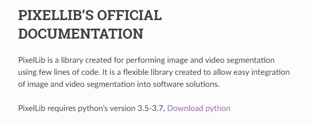
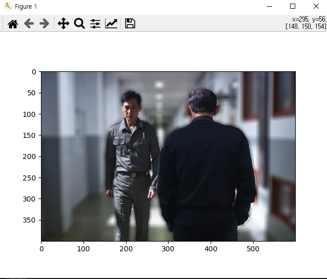
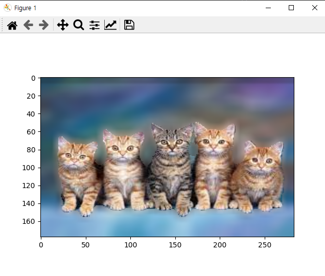
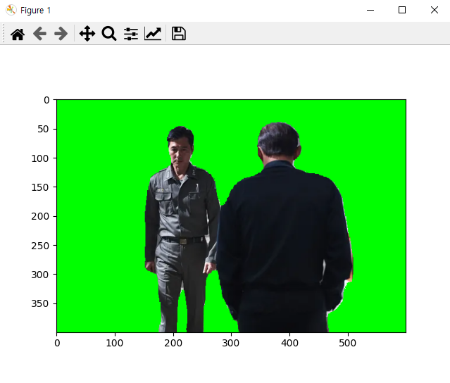
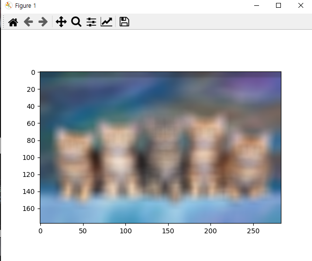

# 배경 블러 처리 프로젝트
핸드폰의 인물사진 모드 경험 많이 해보셨을 텐데, 핸드폰의 경우 2개의 카메라를 이용해서 일반렌즈와 망원 렌즈의 결합으로 피사체의 포커스만 있게 하고 배경을 흐리게 하는 기법을 제공합니다.

이 프로젝트는 이런 모드를 코드를 통해 구현해보고자 합니다.

# 프로젝트 진행 과정

1. 이미지 촬영
2. Segmentation 기법을 사용해 피사체와 배경 분리
3. 분리된 배경 블러 처리
4. 분리된 이미지들 다시 합성

# Challenge

로컬에서 시행하기 위해 PIXELLIB이 제공하는 버전 맞추기

```
pip install keras==2.4.3
pip install tensorflow==2.4.1
pip install pixellib==0.6.6
```

[주의]
혹시라도 텐터플로우 디렉토리 권한 문제로 다운그레이드에 에러가 생기신다면 프롬프트를 관리자 권한으로 실행한 후 뒤에 '--user'옵션을 사용하면 설치 가능합니다.
"pip install tensorflow==2.4.1 --user"


# 더 나아가기

1. 왜 semantic segmentation에서 CNN 마지막 한 픽셀이 입력값의 큰 영역을 커버하는지 여부가 중요한가?

# 파일 설명

[Quest.ipynb]
- 코드들이 실행되는 과정들을 담은 ipynb 파일
- 어떤 과정에서 시행되는지 파악하는 용도로 사용하시면 됩니다.

[README.md]
- 지금 보여지는 마크다운 형식의 프로젝트 설명 파일

[plt.md]
- 아이펠 프로그램에서 진행하는 코드 피어 리뷰 마크다운

[module.py]
- 코드들의 실행을 모듈화 시킨 파일

[run_cromaky.py]
- 크로마키 처리 코드 실행 파일

[run_blur.py]
- 블러 처리 코드 실행 파일

[real_time.py]
- 실시간 블러처리 코드 실행 파일

# 실행 방법
같은 폴더내 requirements.txt로 패키지 설치
파이썬 버전은 꼭 3.5~3.7안에서 실행 [pixelib 패키지 의존정 때문]

# 실행 결과
## 인물모드 사진


## 동물 사진


## 배경전환 크로마키 사진


# 문제점!

코드를 보니 라벨을 하나하나 설정해서 사람에게 맞는 모듈, 고양이에게 맞는 모듈 따로 지정해야하는 걸로 보입니다.

# 솔루션
이런 문제들을 처음에 input값으로 원하는 대상 지정하게 하거나, 또는 움직이는 피사체의 경우 약간의 움직임이 있는 대상에 포커스를 맞추게 한는 등의 기법으로 해결가능해 보입니다.

# 회고

## 배운점

## 아쉬운점

## 느낀점

# 참고자료

[DeepLab V3](https://bloglunit.wordpress.com/2018/07/02/deeplab-v3-encoder-decoder-with-atrous-separable-convolution-for-semantic-image-segmentation/)


# requirements.txt 생성
conda list --export > requirements.txt

# 가상환경 설치
pip install -r requirements.txt