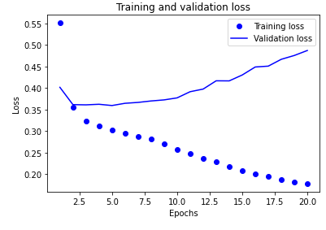
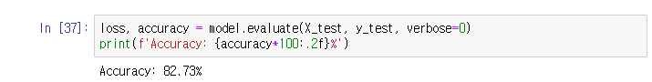
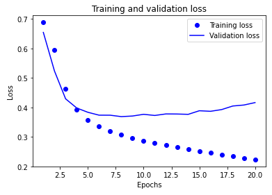
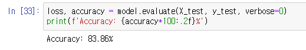
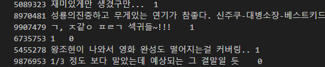
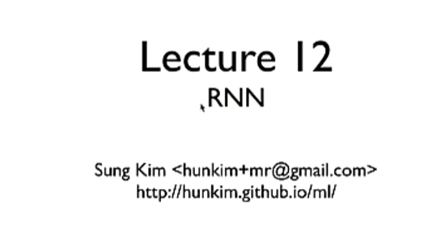
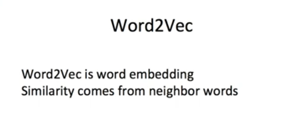

### [피어리뷰 보러가기(클릭)](PRT.md)

# 프로젝트 설명
**프로젝트: 네이버 영화리뷰 감성분석 도전**
네이버 영화 리뷰 속 이용자의 감정이 긍정인지 혹은 부정인지를 분류(Classification) 하는 딥러닝 모델 만들기

## 데이터
네이버 영화의 댓글을 모아 구성된 Naver Sentiment Movie Corpus

# 프로젝트 진행 과정
1. 텍스트

# Challenge
1. 텍스트 데이터를 어떻게 기계가 학습 가능한 형태의 숫자 행렬로 표현 가능한가
인코딩 작업을 통해 텍스트를 벡터로 변환하는 데 이때 단어의 의미를 나타내는 벡터를 짝짓는 것이 중요하기에 Embedding 레이어랄 활용하여 이를 해결한다

2. 순서가 텍스트에서 중요한데 이 순서를 인공지능이 어떻게 반영해야 하는가

# 목표
1. 다양한 방법으로 Text Classification 태스크를 성공적으로 구현
2. gensim을 활용하여 자체학습된 혹은 사전학습된 임베딩 레이어를 분석
3. 한국어 Word2Vec을 활용하여 가시적인 성능향상을 달성

# 파일 설명

# 실행 방법
## requirements.txt 생성
conda list --export > requirements.txt

## 가상환경 설치
pip install -r requirements.txt

# 실행 결과
## 기본 LSTM 모델

## word2Vec 적용

# 솔루션
사전 학습 모델을 활용하여 파라미터 튜닝을 통해 해결가능해 보임

훈련에 사용된 데이터 셋에도 전처리가 필요해 보이는 부분들이 보여서 처리하는 작업이 필요해 보임

# 회고

## 배운점
konlp 패키지가 가진 여러 문제점들이 있어서, 윈도우 환경보다도 우분투나 리눅스 환경에서 해야한다는걸 깨달았습니다.

## 아쉬운점
제대로 모델을 많이 돌려보지 못해 너무 아쉬웠습니다.

## 느낀점
정말 한글은 어려운 언어구나 하는 생각이 들었습니다.

## 궁금한 내용
1. GlobalMaxPooling1D와 Max Pooling의 차이점은 뭔가?
- GlobalMP는 여기서는 전체 문장 또는 나뉘어진 전체 집합에서 가장 중요한 단어를 피처로 추출하는 방식
- Max Pooling은 각 대상 영역에서 가장 중요한 단어를 피처로 추출하는 방식

2. 워드 벡터를 다루는 여러 패키지들이 있는거 같은데, 어떤 것들이 있고 어떤 장단점들이 있는가?
- 

# 참고자료

[11-02 자연어 처리를 위한 1D CNN(1D Convolutional Neural Networks)](https://wikidocs.net/80437)

[[바람돌이/딥러닝] LSTM, GRU 이론 및 개념(Long Short Term Memory, Gated Recurrent Unit)](https://blog.naver.com/winddori2002/221992543837)

[Gated Recurrent Units](https://yjjo.tistory.com/18)

