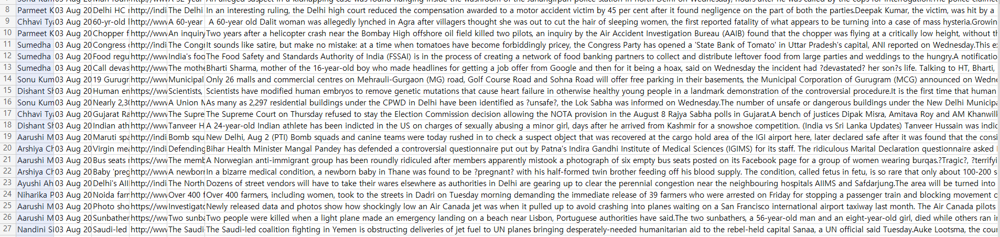

### [피어리뷰 보러가기(클릭)](PRT.md)

# 프로젝트 설명
**프로젝트: 뉴스 요약봇 만들기**

## 데이터

# 프로젝트 진행 과정 [Quest.ipynb]
1. 데이터 수집
2. 데이터 전처리하기 (추상적 요약)
3. 어텐션 메커니즘 사용하기 (추상적 요약)
4. 실제 결과와 요약문 비교하기 (추상적 요약)
5. Summa을 이용해서 추출적 요약해보기

# Challenge

# 목표
1. Abstractive 모델 구성을 위한 텍스트 전처리 단계가 체계적으로 진행되었다.
2. 텍스트 요약모델이 성공적으로 학습되었음을 확인하였다.
3. Extractive 요약을 시도해 보고 Abstractive 요약 결과과 함께 비교해 보았다.

# 파일 설명

## Scoring Function

## Model Summary

# 실행 방법
## requirements.txt 생성
conda list --export > requirements.txt

## 가상환경 설치
pip install -r requirements.txt

# 실행 결과

## Abstractive 모델 구성을 위한 텍스트 전처리

## 텍스트 요약모델

## Extractive 요약

## Abstractive 요약

# 솔루션

# 회고

## 배운점

## 아쉬운점

## 느낀점

## 궁금한 내용

# 참고자료

1. [[자연어처리][paper review] A Neural Attention Model for Abstractive Sentence Summarization](https://supkoon.tistory.com/40)

2. 