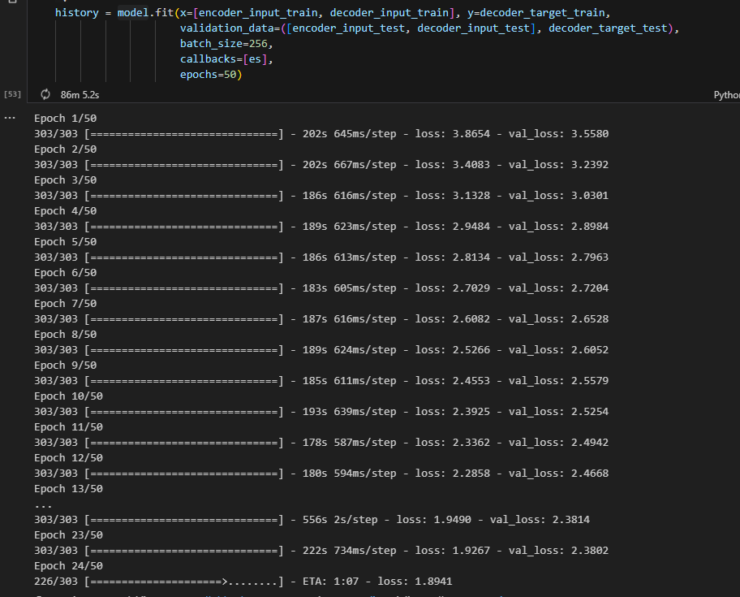
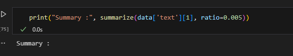
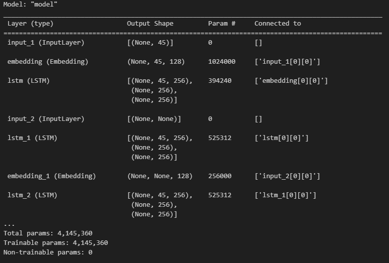
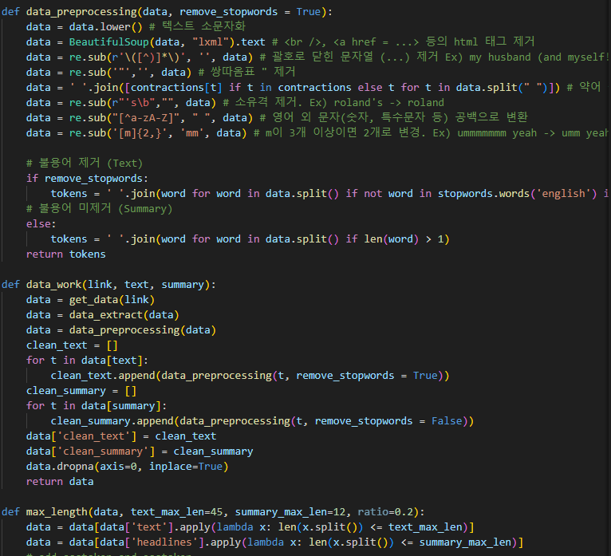

### [피어리뷰 보러가기(클릭)](PRT.md)

# 프로젝트 설명
**프로젝트: 뉴스 요약봇 만들기**


## 데이터


# 프로젝트 진행 과정 [Quest.ipynb]
1. 데이터 수집
2. 데이터 전처리하기 (추상적 요약)
3. 어텐션 메커니즘 사용하기 (추상적 요약)
4. 실제 결과와 요약문 비교하기 (추상적 요약)
5. Summa을 이용해서 추출적 요약해보기

# Challenge

그림에서 볼 수 있듯이 모델자체가 무거워 리소스를 많이 잡아 먹었다.
한번의 테스트에도 1~2시간이 걸리기에 많은 튜닝이 버거운 상황


# 목표
1. Abstractive 모델 구성을 위한 텍스트 전처리 단계가 체계적으로 진행되었다.

2. 텍스트 요약모델이 성공적으로 학습되었음을 확인하였다.

3. Extractive 요약을 시도해 보고 Abstractive 요약 결과과 함께 비교해 보았다.


위 사진처럼 어째서인지 Extractive 요약에 문제가 생겨 해결중입니다.

# 파일 설명
[module/data_preprocessing.py]
데이터 전처리만을 담은 모듈 파일
[module/model.py]
딥러닝 아키텍처를 담은 파일
[module/train_data.py]
위 전처리 및 아키텍처의 전반적인 플로우를 담당하는 파일

[data/model.h5]
모델 22에폭 학습 후 저장한 파일

[Quest.ipynb]
퀘스트 수행을 위한 전체적인 플로우를 담은 ipynb 파일

## Model Summary

인코딩 레이어와 디코딩 레이어 포함 시킨 모델
인코딩에는 임베딩 레이어와 3개의 LSTM 모델이 포함되어 있고
디코딩에는 임베딩 레이어와 LSTM 모델이 포함되어 있음

# 실행 결과

## Abstractive 모델 구성을 위한 텍스트 전처리

데이터 전처리를 위해 따로 모듈을 구성시켜 보았습니다.
"module/data_preprocessing.py"파일에서 확인 가능합니다.

## 텍스트 요약모델

```
원문 : answer scripts reportedly university mumbai results students yet declared answer scripts could transit scanning centre lost due entry wrong question paper code assessment software officials said 
실제 요약 : mumbai university over 
1/1 [==============================] - 1s 1s/step
1/1 [==============================] - 0s 18ms/step
1/1 [==============================] - 0s 17ms/step
1/1 [==============================] - 0s 18ms/step
1/1 [==============================] - 0s 21ms/step
1/1 [==============================] - 0s 18ms/step
1/1 [==============================] - 0s 17ms/step
1/1 [==============================] - 0s 17ms/step
예측 요약 :  mumbai university to be held for
```
'Quest.ipynb'에서 확인 가능

# 솔루션
로컬 환경에서 구현을 시도하다 보니 여러 에러와 렉등을 마주하였습니다.
물론 서버에서 진행한다면 마주하지 않아도 될 문제이기도 하지만 개인적으로 임베딩 및 실시간 구현에 흥미가 있다보니 반대로 경량화 쪽으로 공부하고 개선해 나가야할 것으로 보입니다.

# 회고

## 배운점
nlp와 어텐션 모델을 처음 다뤄보았는데, 생각보다 그 구조가 탄탄하고 CV와 다른 매력이 있다는 사실을 배웠습니다.
다양한 패키지들의 의존성 및 레이어간 연결 그리고 LSTM을 더 깊게 공부했습니다.

## 아쉬운점
하루라는 시간안에 완성을 해야하다 보니 생각보다 완성도 면에서 그리 높지 않아 아쉬웠습니다.
개인적으로 따로 개선하는 시간을 가져봐야할 거 같습니다. (모듈간 의존성, 자동화)

## 느낀점
재밌었지만 반대로 인내의 시간이었습니다. 생각보다 쉽지 않은 난이도에 놀랐습니다.

## 궁금한 내용
마지막에 디코더 모델을 재구성하였는데, 코드 어디를 보더라도 이전에 학습한 model함수를 다시 사용하지 않아 보입니다. 결국 학습한 모델은 어디서 재사용 되는지 그 구조가 궁금합니다.

# 참고자료

1. [[자연어처리][paper review] A Neural Attention Model for Abstractive Sentence Summarization](https://supkoon.tistory.com/40)