### [피어리뷰 보러가기(클릭)](PRT.md)

# 프로젝트 설명
**프로젝트: 트랜스포머로 만드는 대화형 챗봇**


## 데이터
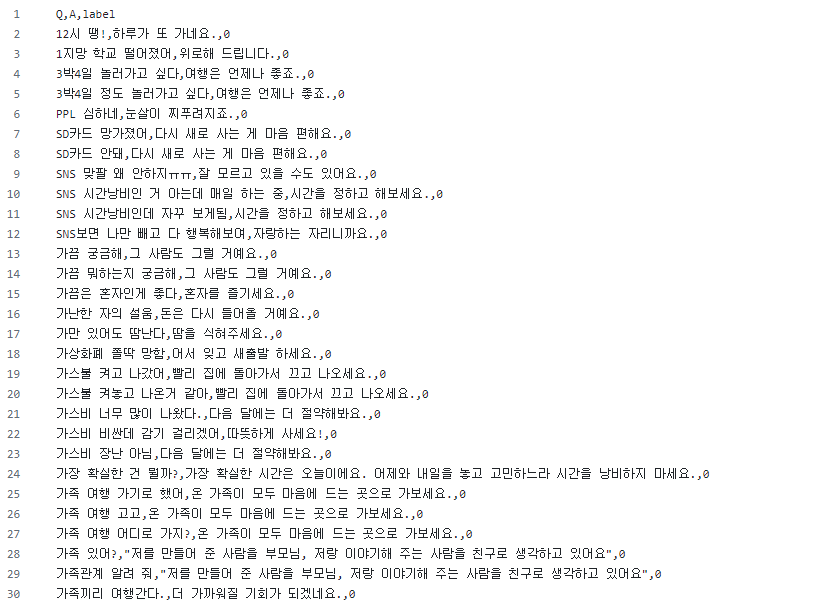

# 프로젝트 진행 과정
1. 데이터 수집
2. 데이터 전처리하기
3. SubwordTextEncoder 토크나이저 사용하기
4. 트랜스포머 모델 구현
5. 전처리 방법을 고려해 입력된 문장에 대한 대답을 얻는 예측 함수 평가

# 목표
1. 한국어 전처리를 통해 학습 데이터셋을 구축하였다.
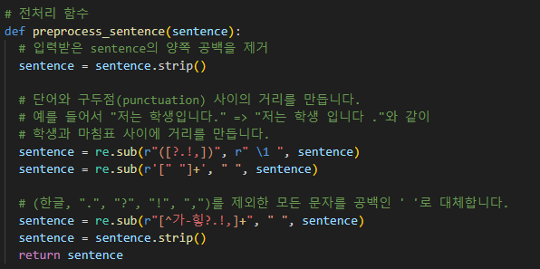
한국어 형식에 맞게 전처리 모델을 손봐 구축해보았습니다.

2. 트랜스포머 모델을 구현하여 한국어 챗봇 모델 학습을 정상적으로 진행하였다.

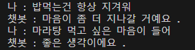
2번 3번은 chatbot.py 파일을 통해 실시간으로 입력해서 챗봇과 소통하게 구현해보았습니다.

3. 한국어 입력문장에 대해 한국어로 답변하는 함수를 구현하였다.

이하 동문

4. 트랜스포머 깃헙의 코드들을 불러와 구현해보기

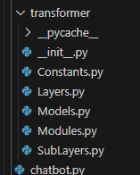

최대한 트랜스포머 깃헙 페이지 코드들의 구성도를 따라서 파일들을 구현해보았습니다.
[아래 트랜스포머 깃헙 페이지 폴더]

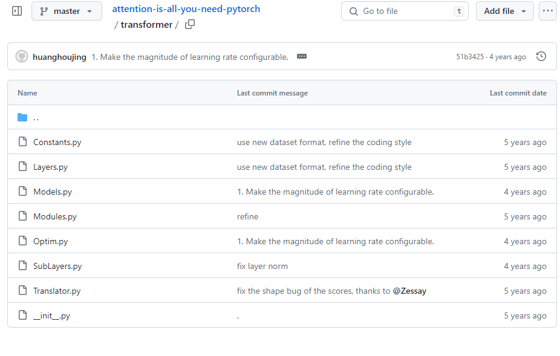

# 파일 설명

```
Quest8_20240619/
├── data/
│   └── __pycache__/
├── model/
│   ├── transformer_20epoch_202406201156.h5
├── tokenizer/
│   ├── tokenizer
├── transformer/
│   ├── Layers.py
│   ├── Models.py
│   ├── Modules.py
│   ├── SubLayers.py
├── train.py
├── test.py
```

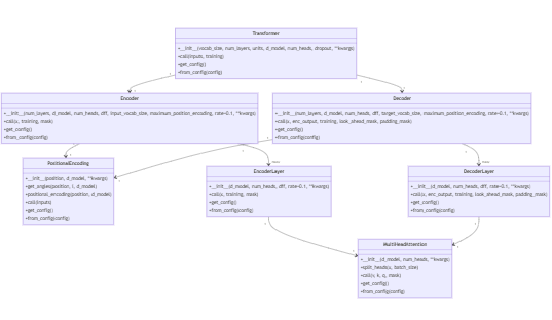

# Requirements

1. Python 3.9
2. Tensorflow 4.9.3
3. numpy 1.23.0
4. tensorflow_datasets 4.9.2

# 모델 설명

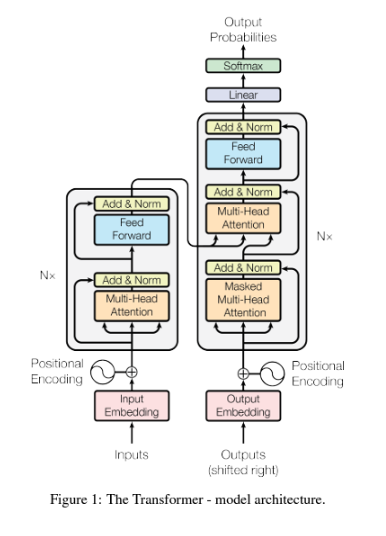

이 모델은 **[Attention is All you Need](https://github.com/jadore801120/attention-is-all-you-need-pytorch/tree/master)**에서 최대한 참고하여 재구현한 모델입니다.

전체적인 트랜스포머 모델은 [트랜스포머.py](transformer/Models.py) 파일 안의 transformer 함수로 시작됩니다.

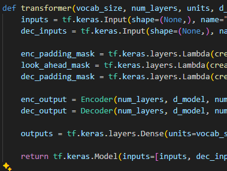

모델 그림의 좌측 인풋 값 [여기서는 이별 관련 인공데이터](https://github.com/songys/Chatbot_data/tree/master)을 통해 데이터가 들어가고 아래 패딩 마스크와 함께 인코더 인풋은 인코더로 디코더 인풋은 디코더로 보내 각각 아웃풋 데이터를 얻습니다. 인풋 데이터는 디코더 인풋과 함께 디코더에 들어가고 디코더 아웃풋은 덴스층을 거쳐 아웃풋으로 출력됩니다.

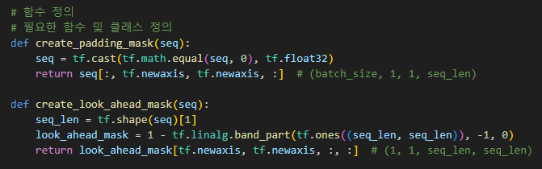

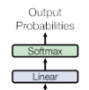

세부적인 인코더 디코더 안을 보기전에 논문속 모델은 Linear 레이어와 Softmax 레이어를 거치는 것을 확인 할 수 있다.


이 코드에서는 딱히 두 레이어가 없다고 느껴질 수 있지만, 차근차근 다시 분석하면 세부 내용들을 볼 수 있다.

1. Linear 레이어: 디코더의 출력을 완전 연결(Linear) 레이어를 통해 처리되어 각 단어의 로짓(logits)을 계산
2. Softmax 함수: Linear 레이어의 출력에 소프트맥스 함수를 적용해 각 단어의 확률을 계산

```
outputs = tf.keras.layers.Dense(units=vocab_size, name="outputs")(dec_outputs)
```

코드의 가장 마지막 Dense레이어를 보면 모델에서 마지막 결과물을 Dense레이어를 사용하여 vocab_size 차원으로 출력하는 것을 볼 수 있다. 이는 Linear레이어와 동일한 역할을 하는것으로 불 수 있다.

Softmax 함수는 명시적으로 보이지 않지만,

```
   # 모델 컴파일
    learning_rate = 1e-4
    model.compile(optimizer=tf.keras.optimizers.Adam(learning_rate),
                loss=tf.keras.losses.SparseCategoricalCrossentropy(from_logits=True),
                metrics=[tf.keras.metrics.SparseCategoricalAccuracy()])
```
컴파일 하는 부분에서 사용한 loss인 SparseCategoricalCrossentropy 함수에서 내부적으로 로짓에 소프트맥스를 적용한 것을 볼 수 있다.

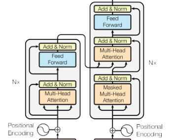

이제 안쪽 모델도 살펴보겠습니다. 우선 두개의 인풋들은 임베딩 과정에서 Positional Encoding레이어를 추가적으로 거칩니다. 트랜스포머의 특징은 여타 다른 순차적인 레이어를 가진 RNN과 같은 모델과 다르게 데이터를 한번에 받습니다. RNN의 경우 순서대로 데이터가 들어오기에 문장 순서를 따로 집어넣을 필요가 없지만 transformer의 경우 위치 정보를 Positional Encoding을 추가 입력하여 이를 해결합니다.

[트랜스포머.py](transformer/Models.py)안의 Positional Encoding 함수에서 코드를 볼 수 있는데.
쉽게 해석하면 

$PE_{(pos,2i)} = sin(\frac{pos}{10000^{2i/d_{model}}})$
$PE_{(pos,2i+1)} = cos(\frac{pos}{10000^{2i/d_{model}}})$

위 공식에 맞춰 구현을 한 것이다.
짝수는 sin을 홀수는 cos을 적용하였고 (짝수에 sin 홀수에 cos은 언어모델의 관례같은것으로 보인다)
시퀀스상의 특정 위치인 $pos$를 모델의 차원수를 반영한 수치만큼 나눠 인코딩의 주기를 조절 하는 식으로 동작한다.

# 실행 결과


실행결과 간단한 문장에 대한 비슷한 맥락의 대답을 시행하는 거 같다.

# Challenge
1. 로컬에서 진행하다 보니 패키지간의 의존성 문제 발생 - 최대한 기존 코드들을 그대로 사용해보고 싶어 tensorflow 버전에 맞춰 (tensorflow 4.9.3) numpy, matplotlib, tqdm, tensorflow_datasets 등등 그에 맞게 버전을 맞춰주었다.
-> 가장 좋은 방법은 새로 가상환경을 만들고 내가 제일 원하는 패키지 버전 설치 후 (tensorflow 4.9.3) 코드들을 시행하면서 설치해야하는 패키지들에 적절한 버전들을 설치해주는것. 적절한 버전은 몇번 가상환경을 생성 및 삭제를 진행하면서 찾아 한곳에 적어두는게 좋은것 같다.

2. 커스텀 레이어들이 많기 때문에 각 레이어 클래스에 'get_config' 메서드를 추가해줘야 한다는 에러가 발생
-> 각 레이어 별로 아래의 코드 추가하는 식으로 해결
```
def get_config(self):
        config = super().get_config()
        config.update({
            "num_layers": self.num_layers,
            "d_model": self.d_model,
            "num_heads": self.num_heads,
            "dff": self.dff,
            "target_vocab_size": self.target_vocab_size,
            "maximum_position_encoding": self.maximum_position_encoding,
            "rate": self.rate,
        })
        return config

 @classmethod
    def from_config(cls, config):
        return cls(**config)
```

# 회고

## 배운점

## 아쉬운점

## 느낀점

## 궁금한 내용

# 참고자료
