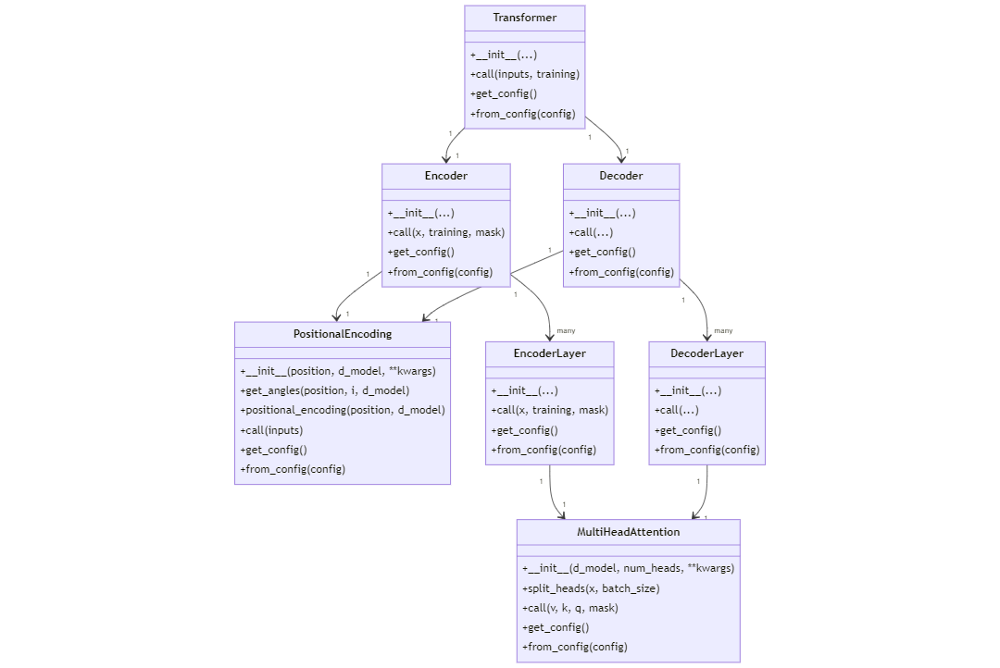

### [피어리뷰 보러가기(클릭)](PRT.md)

# 프로젝트 설명
**프로젝트: 트랜스포머로 만드는 대화형 챗봇**


## 데이터


# 프로젝트 진행 과정
1. 데이터 수집
2. 데이터 전처리하기
3. SubwordTextEncoder 토크나이저 사용하기
4. 트랜스포머 모델 구현
5. 전처리 방법을 고려해 입력된 문장에 대한 대답을 얻는 예측 함수 평가

# 목표
1. 한국어 전처리를 통해 학습 데이터셋을 구축하였다.


한국어 형식에 맞게 전처리 모델을 손봐 구축해보았습니다.

2. 트랜스포머 모델을 구현하여 한국어 챗봇 모델 학습을 정상적으로 진행하였다.


2번 3번은 chatbot.py 파일을 통해 실시간으로 입력해서 챗봇과 소통하게 구현해보았습니다.

3. 한국어 입력문장에 대해 한국어로 답변하는 함수를 구현하였다.

[위 내용과 동일]

4. 트랜스포머 깃헙의 코드들을 불러와 구현해보기


최대한 트랜스포머 깃헙 페이지 코드들의 구성도를 따라서 파일들을 구현해보았습니다.
Optim, Translator는 아쉽게도 시간상 구현하지 못했다.

[아래 트랜스포머 깃헙 페이지 폴더]


# 파일 설명

```
Quest8_20240619/
├── data/
│   └── __pycache__/
├── model/
│   ├── transformer_20epoch_202406201156.h5
├── tokenizer/
│   ├── tokenizer
├── transformer/
│   ├── Layers.py
│   ├── Models.py
│   ├── Modules.py
│   ├── SubLayers.py
├── train.py
├── test.py
```



# Requirements

1. Python 3.9
2. Tensorflow 4.9.3
3. numpy 1.23.0
4. tensorflow_datasets 4.9.2

# 모델 설명


이 모델은 [Attention is All you Need](https://github.com/jadore801120/attention-is-all-you-need-pytorch/tree/master)에서 최대한 참고하여 재구현한 모델입니다.

전체적인 트랜스포머 모델은 [트랜스포머.py](transformer/Models.py) 파일 안의 transformer 함수로 시작됩니다.


모델 그림의 좌측 인풋 값 여기서는 [이별 관련 인공데이터](https://github.com/songys/Chatbot_data/tree/master)을 통해 데이터가 들어가고 아래 패딩 마스크와 함께 인코더 인풋은 인코더로 디코더 인풋은 디코더로 보내 각각 아웃풋 데이터를 얻습니다. 인풋 데이터는 디코더 인풋과 함께 디코더에 들어가고 디코더 아웃풋은 덴스층을 거쳐 아웃풋으로 출력됩니다.


세부적인 인코더 디코더 안을 보기전에 논문속 모델은 Linear 레이어와 Softmax 레이어를 거치는 것을 확인 할 수 있다.


이 코드에서는 딱히 두 레이어가 없다고 느껴질 수 있지만, 차근차근 다시 분석하면 세부 내용들을 볼 수 있다.

1. Linear 레이어: 디코더의 출력을 완전 연결(Linear) 레이어를 통해 처리되어 각 단어의 로짓(logits)을 계산
2. Softmax 함수: Linear 레이어의 출력에 소프트맥스 함수를 적용해 각 단어의 확률을 계산

```
outputs = tf.keras.layers.Dense(units=vocab_size, name="outputs")(dec_outputs)
```

코드의 가장 마지막 Dense레이어를 보면 모델에서 마지막 결과물을 Dense레이어를 사용하여 vocab_size 차원으로 출력하는 것을 볼 수 있다. 이는 Linear레이어와 동일한 역할을 하는것으로 불 수 있다.

Softmax 함수는 명시적으로 보이지 않지만,

```
   # 모델 컴파일
    learning_rate = 1e-4
    model.compile(optimizer=tf.keras.optimizers.Adam(learning_rate),
                loss=tf.keras.losses.SparseCategoricalCrossentropy(from_logits=True),
                metrics=[tf.keras.metrics.SparseCategoricalAccuracy()])
```
컴파일 하는 부분에서 사용한 loss인 SparseCategoricalCrossentropy 함수에서 내부적으로 로짓에 소프트맥스를 적용한 것을 볼 수 있다.


이제 안쪽 모델도 살펴보겠습니다. 우선 두개의 인풋들은 임베딩 과정에서 Positional Encoding레이어를 추가적으로 거칩니다. 트랜스포머의 특징은 여타 다른 순차적인 레이어를 가진 RNN과 같은 모델과 다르게 데이터를 한번에 받습니다. RNN의 경우 순서대로 데이터가 들어오기에 문장 순서를 따로 집어넣을 필요가 없지만 transformer의 경우 위치 정보를 Positional Encoding을 추가 입력하여 이를 해결합니다.

[트랜스포머.py](transformer/Models.py)안의 Positional Encoding 함수에서 코드를 볼 수 있는데.
쉽게 해석하면 

$PE_{(pos,2i)} = sin(\frac{pos}{10000^{2i/d_{model}}})$
$PE_{(pos,2i+1)} = cos(\frac{pos}{10000^{2i/d_{model}}})$

위 공식에 맞춰 구현을 한 것이다.
짝수는 sin을 홀수는 cos을 적용하였고 (짝수에 sin 홀수에 cos은 언어모델의 관례같은것으로 보인다)
시퀀스상의 특정 위치인 $pos$를 모델의 차원수를 반영한 수치만큼 나눠 인코딩의 주기를 조절 하는 식으로 동작한다.

```
class Encoder(tf.keras.layers.Layer):
    def __init__(self, num_layers, d_model, num_heads, dff, input_vocab_size, maximum_position_encoding, rate=0.1, **kwargs):
        super(Encoder, self).__init__(**kwargs)

        self.num_layers = num_layers
        self.d_model = d_model
        self.num_heads = num_heads
        self.dff = dff
        self.input_vocab_size = input_vocab_size
        self.maximum_position_encoding = maximum_position_encoding
        self.rate = rate

        self.embedding = tf.keras.layers.Embedding(input_vocab_size, d_model)
        self.pos_encoding = PositionalEncoding(maximum_position_encoding, self.d_model)
        self.enc_layers = [EncoderLayer(d_model, num_heads, dff, rate) for _ in range(num_layers)]
        self.dropout = tf.keras.layers.Dropout(rate)
```

이 Positional Encoding 레이어는 위 코드의 마지막 블록에서 확인할 수 있듯이 인코더, 디코더를 선언할때 임베딩 작업 후 들어간다.

```
self.enc_layers = [EncoderLayer(d_model, num_heads, dff, rate) for _ in range(num_layers)]
```

위 모델 그림에서 확인 할 수 있듯이 Encoding Layer는 num_layers 만큼 반복된다
num_layers는 우리가 지정하는 하이퍼 파라미터 값이다.


이제 각 레이어별로 살필 것인데 [Layer.py](transformer/Layers.py)에서 확인 가능하다.
[EncoderLayer, DecoderLayer]

```
def call(self, x, training, mask):
        attn_output = self.mha(x, x, x, mask)  # (batch_size, input_seq_len, d_model)
        attn_output = self.dropout1(attn_output, training=training)
        out1 = self.layernorm1(x + attn_output)  # (batch_size, input_seq_len, d_model)

        ffn_output = self.ffn(out1)  # (batch_size, input_seq_len, d_model)
        ffn_output = self.dropout2(ffn_output, training=training)
        out2 = self.layernorm2(out1 + ffn_output)  # (batch_size, input_seq_len, d_model)
```
이 코드에서 볼 수 있듯이 Multi-Head Attention(여기서는 mha)를 거쳐 생긴 결과물이 초기 입력값 (여기서는 x, out1)과 함께 Add & Norm(여기서는 layernorm1,2)을 들어가 처리된다.

디코더 레이어도 같은 방식으로
```
    def call(self, x, enc_output, training, look_ahead_mask, padding_mask):
        attn1 = self.mha1(x, x, x, look_ahead_mask)  # (batch_size, target_seq_len, d_model)
        attn1 = self.dropout1(attn1, training=training)
        out1 = self.layernorm1(x + attn1)  # (batch_size, target_seq_len, d_model)

        attn2 = self.mha2(enc_output, enc_output, out1, padding_mask)  # (batch_size, target_seq_len, d_model)
        attn2 = self.dropout2(attn2, training=training)
        out2 = self.layernorm2(out1 + attn2)  # (batch_size, target_seq_len, d_model)

        ffn_output = self.ffn(out2)  # (batch_size, target_seq_len, d_model)
        ffn_output = self.dropout3(ffn_output, training=training)
        out3 = self.layernorm3(out2 + ffn_output)  # (batch_size, target_seq_len, d_model)

        return out3
```
여기서도 그림과 같은 방식대로 진행되는 것을 볼 수 있고 조금 특이사항은 encoder레이어 층의 결과물 (enc_output 여기서는 2번 쓰임)을 학습에 반영하는 것을 볼 수 있다.

크게 인코더 디코더 그리고 새부적인 인코더층 디코더층을 다뤄봤다. 이제 각 레이어 별로 쓰이는 Multi-Head Attention, FeedForward, Masked Multi-Head Attention을 다뤄보겠다. (여기서 Add & Norm 층은 간단하게 케라스의 tf.keras.layers.LayerNormalization()으로 구현하였기에 넘어가겠다.)

이 트랜스포머 모델은 총 3가지의 Attention을 사용한다.
1. Encoder Self-Attention [Multi-head Attention]
- 인코더 입력으로 들어가 문장 내 단어들 간의 유사도 서로 구함
2. Masked Decoder Self-Attention [Masked Multi-head Attention]
- 단어를 생성하는 디코더 층이 앞서 생성된 앞 단어들과의 유사도를 구함
3. Encoder-Decoder Attention [Multi-head Attention]
- 인코더에 입력된 단어들과 유사도를 구함

모델 설명 그림에는 나와 있지 않지만 지금쯤 의문을 가질텐데 계속 반복되는 단어들간의 유사도는 Scaled-dot Product Attention을 통해 구한다.

그럼 다시 정리해서 총 4가지를 다뤄보겠다.

1. Multi-Head Attention

[SubLayers.py](transformer/SubLayers.py)에서 확인 가능

위 모델 설명 그림에서 특이하게 보았을 텐데 입력값으로 데이터를 여러개 받아들이는 형식의 모델이다.


이런식으로 multi_head를 사용해 병렬로 어텐션을 수행하게 되면 여러 관점에서 모델이 데이터를 바라볼 수 있다라는 새로운 장점이 생긴다.

위 그림처럼 한 head는 문장 타입에 집중하는 어텐션을 줄 수도 있고, 다른 head는 명사에 집중하는 어텐션, 또다른 head는 관계에 집중하는 어텐션 등등 multi-head는 같은 문장 내 여러 관계 또는 다양한 소스 정보를 나타내는 정보들에 집중하는 어텐션을 줄 수 있다.

2. FeedForward

[SubLayers.py](transformer/SubLayers.py)에서 확인 가능

시퀀셜한 층으로 2개의 Dense층으로 구성

3. Masked Multi-Head Attention

[Layers.py](transformer/Layers.py)에서 확인 가능
DecoderLayer함수 안의 MultiHeadAttention 모듈을 부를 때 마스크로 look_ahead_mask를 사용한 것을 확인 할 수 있다.

다음 단어를 예측하는 것이 주 목적이기에 디코더의 층의 경우 그 다음 단어에 해당하는 부분을 가리는 Look-Ahead Masking기법을 사용

```
def create_look_ahead_mask(seq):
    seq_len = tf.shape(seq)[1]
    look_ahead_mask = 1 - tf.linalg.band_part(tf.ones((seq_len, seq_len)), -1, 0)
    return look_ahead_mask[tf.newaxis, tf.newaxis, :, :]  # (1, 1, seq_len, seq_len)
```

Look Ahead Mask 함수 자체는 [Models.py](transformer/Models.py)에서 확인 가능

4. Scaled-dot Product Attention

어탠션 기법이 단어들 간의 유사도를 구하는 매커니즘이다. 다음 공식으로 구현되었다.

$Attention(Q,K,V) = softmax(\frac{QK^{T}}{\sqrt{d_{k}}})V$

Attention이 주어진 Query에 대해 모든 Key 값과의 유사도를 각각 구합니다. 각 유사도를 각 키와 맵핑된 Value에 반영하여 뭉쳐주면 최종 결과물인 Attention Value를 구할 수 있음.

[Modules.py](transformer/Modules.py)에서 확인 가능
위 공식을 코드로 구현해 Attention Value를 리턴하게 하는 함수이다.

# 실행 결과


실행결과 간단한 문장에 대한 비슷한 맥락의 대답을 시행하는 거 같다.

# Challenge
1. 로컬에서 진행하다 보니 패키지간의 의존성 문제 발생 - 최대한 기존 코드들을 그대로 사용해보고 싶어 tensorflow 버전에 맞춰 (tensorflow 4.9.3) numpy, matplotlib, tqdm, tensorflow_datasets 등등 그에 맞게 버전을 맞춰주었다.
-> 가장 좋은 방법은 새로 가상환경을 만들고 내가 제일 원하는 패키지 버전 설치 후 (tensorflow 4.9.3) 코드들을 시행하면서 설치해야하는 패키지들에 적절한 버전들을 설치해주는것. 적절한 버전은 몇번 가상환경을 생성 및 삭제를 진행하면서 찾아 한곳에 적어두는게 좋은것 같다.

2. 커스텀 레이어들이 많기 때문에 각 레이어 클래스에 'get_config' 메서드를 추가해줘야 한다는 에러가 발생
-> 각 레이어 별로 아래의 코드 추가하는 식으로 해결
```
def get_config(self):
        config = super().get_config()
        config.update({
            "num_layers": self.num_layers,
            "d_model": self.d_model,
            "num_heads": self.num_heads,
            "dff": self.dff,
            "target_vocab_size": self.target_vocab_size,
            "maximum_position_encoding": self.maximum_position_encoding,
            "rate": self.rate,
        })
        return config

 @classmethod
    def from_config(cls, config):
        return cls(**config)
```

# 회고

꾀나 잘 만들어진 코드를 여러 방식으로 분석할 수 있던 계기가 되었고, 프로젝트를 통해서도 지루하지 않게 공부 할 수 있었다.

## 배운점

Attention이 어떤 구조로 이뤄져 있는 건지 배울 수 있는 기회였고 반대로 이미지에도 트랜스포머를 적용한다고 하는데 어떻게 적용하는지도 궁금해 졌다.

## 아쉬운점

시간이 더 있다면 각 공식들을 직접 손으로 계산하면서 모듈이 돌아가는 원리를 더 깊게 분석해보거나, 논문을 읽어보면서 각 코드들의 원리 및 의도를 파악했을 것 같은데 깊게 하지 못해 아쉬웠다.

## 느낀점

뜯어보면 볼수록, 더 작게 나눠서 볼수록 복잡하기만 했던 내용들이 이해되기 시작해서 좋았습니다.

## 궁금한 내용


scaled_attention_logits에 왜 일정 비율의 mask를 더했는가.
값이 너무 적어져 사라지는 문제를 방지하는 의도는 이해 했지만 작은 수로 더하는 방법도 있는데 왜 mask의 비율에 맞게 했는가


이 split_heads의 역할. 왜 꼭 그 순서를 바꿔야 했는가(홀수 끼리, 짝수끼리 배치?)

# 참고자료

* [Transformers, explained: Understand the model behind GPT, BERT, and T5](https://www.youtube.com/watch?v=SZorAJ4I-sA)
* [트랜스포머 파헤치기](https://www.blossominkyung.com/deeplearning/transformer-mha)
* [attention-is-all-you-need-pytorch](https://github.com/jadore801120/attention-is-all-you-need-pytorch/tree/master?tab=readme-ov-file)
* [Chatbot_data](https://github.com/songys/Chatbot_data/tree/master)