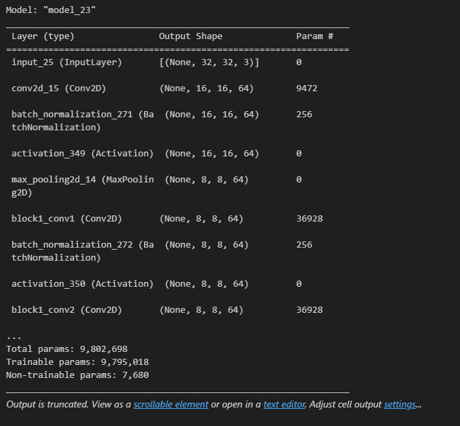

### [피어리뷰 보러가기(클릭)](PRT.md)

# 프로젝트 설명
**프로젝트: ResNet Ablation Study**

## 데이터

# 프로젝트 진행 과정
1. 

# 목표
1.  ResNet-34, ResNet-50 모델 구현이 정상적으로 진행되었는가? [모델 설명](#모델-설명)
- 블록함수 구현이 제대로 진행되었으며 구현한 모델의 summary가 예상된 형태로 출력되었다.

2. 구현한 ResNet 모델을 활용하여 Image Classification 모델 훈련이 가능한가? [실행 결과](#cat-vs-dogs)
- tensorflow-datasets에서 제공하는 cats_vs_dogs 데이터셋으로 학습 진행 시 loss가 감소하는 것이 확인되었다.

3. Ablation Study 결과가 바른 포맷으로 제출되었는가? [실행 결과](#plain-vs-residual)

- ResNet-34, ResNet-50 각각 plain모델과 residual모델을 동일한 epoch만큼 학습시켰을 때의 validation accuracy 기준으로 Ablation Study 결과표가 작성되었다.

# 파일 설명

[Quest.ipynb](Quest.ipynb)
 
퀘스트 수행 ipynb

# Requirements

1. Python 3.9
2. Tensorflow 4.9.3
3. numpy 1.23.0
4. tensorflow_datasets 4.9.2

# 모델 설명
## Down Sampling

## batch norm

## 모델 summary

### Plain
Res 34

Res 50

### ResNET
Res 34

Res 50

# 실행 결과

## Cat vs Dogs

## Plain vs Residual
Plain Accuracy

ResNET Accuracy

학습 에폭이 낮아서 그런지 논문에서 보여주는 그 학습 현황을 제대로 보여주진 못했다

# Challenge

# 회고
모델 세부 층들을 하나하나 구현해볼 수 있는 기회였어서 뜻 깊었습니다.

## 배운점
모델 안에 잔차를 연결하는 법
그리고 텐서의 다운샘플링

## 아쉬운점
시간이 촉박해 구현도에 있어 아쉬움이 있습니다.

## 느낀점
다음부터 여러 실험들을 할수 있게 시간분배를 잘 해야겠다

## 궁금한 내용

# 참고자료

* 